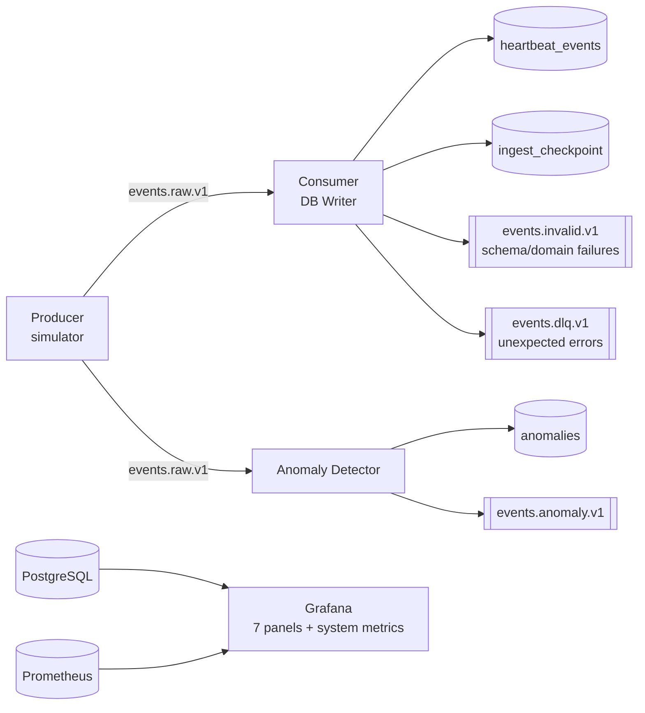

# Real-Time Customer Heartbeat Monitoring System

A data pipeline that simulates real-time heart-rate sensor
data, streams it through Apache Kafka, validates it, stores it in PostgreSQL,
detects physiological anomalies, and visualises everything in Grafana.

## Architecture



## Stack

| Layer | Technology |
|---|---|
| Simulation | Python (Gaussian-baseline simulator) |
| Streaming | Apache Kafka + Zookeeper (Confluent 7.6.1) |
| Processing | Python (confluent-kafka, pydantic) |
| Storage | PostgreSQL 16 |
| Config | pydantic-settings (env-var validated) |
| Metrics | prometheus-client (per-service /metrics endpoints) |
| Dashboards | Grafana 11.4.0 |
| Observability | Kafka UI |
| Testing | pytest |
| Infra | Docker Compose |

## Project Structure

```
DEM10/
├── docker-compose.yml              ← Root-level compose file (use this)
├── .env.example                    ← Copy to .env before running
├── requirements.txt
├── services/
│   ├── common/
│   │   ├── config.py               ← Validated settings (pydantic-settings)
│   │   ├── models.py               ← HeartbeatEvent, AnomalyEvent, InvalidEvent
│   │   ├── simulator.py            ← Physiologically realistic data generator
│   │   ├── kafka_utils.py          ← Hardened producer/consumer factories
│   │   └── db.py                   ← Connection pool + retry logic
│   ├── producer/producer.py        ← Kafka producer (Prometheus + graceful shutdown)
│   ├── consumer/consumer.py        ← DB-writer consumer (Prometheus + graceful shutdown)
│   └── anomaly_detector/
│       ├── anomaly_rules.py        ← Pure, testable rule engine
│       └── detector.py             ← Anomaly consumer (Prometheus + graceful shutdown)
├── db/schema/01_schema.sql         ← Fully-commented PostgreSQL schema
├── tests/
│   ├── unit/
│   │   ├── test_generator.py       ← Simulator unit tests
│   │   ├── test_validation.py      ← Model validation tests
│   │   └── test_anomaly_rules.py   ← Anomaly rule engine tests (new)
│   ├── integration/
│   │   └── test_db_connection.py   ← DB connectivity + schema tests
│   └── load/
│       └── load_smoke.py           ← Throughput smoke test
├── monitoring/
│   ├── grafana/dashboards/         ← 7-panel dashboard (auto-provisioned)
│   └── prometheus/prometheus.yml   ← Scrape config
├── scripts/create-topics.ps1       ← PowerShell topic creation helper
└── docs/architecture/              ← Architecture docs + Mermaid diagrams
```

## Quick Start

### Prerequisites
- Docker Desktop (running)
- Python 3.11+
- PowerShell (Windows)

### 1 – Environment setup

```powershell
# Copy environment template
Copy-Item .env.example .env

# Create and activate virtual environment
python -m venv .venv
.\.venv\Scripts\Activate.ps1

# Install dependencies
pip install -r requirements.txt
```

### 2 – Start infrastructure

```powershell
# From the project root (uses the root docker-compose.yml)
docker compose up -d

# Verify all containers are healthy
docker compose ps
```

### 3 – Create Kafka topics

```powershell
./scripts/create-topics.ps1
```

Or manually:
```powershell
docker exec heartbeat-kafka kafka-topics --bootstrap-server localhost:19092 --create --if-not-exists --topic events.raw.v1     --partitions 24 --replication-factor 1
docker exec heartbeat-kafka kafka-topics --bootstrap-server localhost:19092 --create --if-not-exists --topic events.invalid.v1  --partitions 6  --replication-factor 1
docker exec heartbeat-kafka kafka-topics --bootstrap-server localhost:19092 --create --if-not-exists --topic events.anomaly.v1  --partitions 6  --replication-factor 1
docker exec heartbeat-kafka kafka-topics --bootstrap-server localhost:19092 --create --if-not-exists --topic events.dlq.v1      --partitions 6  --replication-factor 1
```

### 4 – Run the pipeline (3 terminals)

```powershell
# Terminal 1 – Producer (publishes synthetic heartbeat events)
python -m services.producer.producer

# Terminal 2 – Consumer DB Writer (validates + persists to PostgreSQL)
python -m services.consumer.consumer

# Terminal 3 – Anomaly Detector (detects and alerts on anomalies)
python -m services.anomaly_detector.detector
```

### 5 – Verify data flowing

```powershell
# Count ingested events
psql -h localhost -p 55432 -U heartbeat_user -d heartbeat -c "SELECT COUNT(*) FROM heartbeat_events;"

# View recent anomalies
psql -h localhost -p 55432 -U heartbeat_user -d heartbeat -c "SELECT customer_id, anomaly_type, severity, heart_rate FROM anomalies ORDER BY event_time DESC LIMIT 10;"
```

## Service Endpoints

| Service | URL | Credentials |
|---|---|---|
| Grafana | http://localhost:3000 | admin / admin |
| Prometheus | http://localhost:9090 | – |
| Kafka UI | http://localhost:8080 | – |
| Producer /metrics | http://localhost:8000/metrics | – |
| Consumer /metrics | http://localhost:8001/metrics | – |
| Detector /metrics | http://localhost:8002/metrics | – |

## Tests

```powershell
# Unit tests (no Docker required)
pytest tests/unit -q -v

# Integration tests (requires Docker Compose running)
pytest tests/integration -q -v

# Load smoke test (requires Docker Compose running)
python tests/load/load_smoke.py
```

## Key Prometheus Metrics

| Metric | Service | Description |
|---|---|---|
| `heartbeat_messages_produced_total` | Producer | Messages published to Kafka |
| `heartbeat_produce_errors_total` | Producer | Delivery failures |
| `heartbeat_messages_consumed_total` | Consumer | Messages polled from Kafka |
| `heartbeat_db_inserts_total` | Consumer | Rows written to PostgreSQL |
| `heartbeat_invalid_total` | Consumer | Messages routed to invalid topic |
| `heartbeat_dlq_total` | Consumer | Messages routed to DLQ |
| `heartbeat_anomalies_total{type,severity}` | Detector | Anomalies detected (labelled) |

## Grafana Dashboard Panels

1. **Heartbeats Ingested per Minute** – ingestion timeseries
2. **Anomalies per Minute** – anomaly rate timeseries
3. **Anomaly Breakdown by Type** – bar chart (LOW / HIGH / SPIKE)
4. **Average Heart Rate (5 min)** – population mean stat
5. **p95 Heart Rate (5 min)** – 95th percentile stat
6. **Active Customers (5 min)** – distinct customer count stat
7. **Recent Anomalies** – live table of last 20 flagged events

## Anomaly Detection Rules

| Rule | Condition | Severity |
|---|---|---|
| `LOW_HEART_RATE` | rate ≤ 50 bpm | high |
| `HIGH_HEART_RATE` | rate ≥ 140 bpm | high |
| `SPIKE` | \|rate − prev\| ≥ 30 bpm | medium |

All thresholds are configurable via environment variables (`ANOMALY_LOW_THRESHOLD`, `ANOMALY_HIGH_THRESHOLD`, `ANOMALY_SPIKE_DELTA`).

## Troubleshooting

| Symptom | Likely cause | Fix |
|---|---|---|
| `Connection refused localhost:19092` | Kafka not ready | Wait for `docker compose ps` to show Kafka as healthy |
| `Connection refused localhost:55432` | PostgreSQL not ready | Wait for `pg_isready` healthcheck to pass |
| `ModuleNotFoundError: services` | Wrong working directory | Run commands from the project root |
| `NoBrokersAvailable` | Wrong bootstrap server | Check `KAFKA_BOOTSTRAP_SERVERS` in your `.env` |
| Consumer not writing rows | Topics not created | Run `./scripts/create-topics.ps1` |
| Grafana panels show "No data" | DB not connected | Add PostgreSQL datasource in Grafana → Settings → Data Sources |

## Architecture Documentation

- Full architecture: `docs/architecture/architecture-overview.md`
- Data-flow topology: `docs/architecture/topology.md`
- Sequence diagram: `docs/architecture/sequence-ingest.md`
- Windows notes: `docs/runbooks/windows-notes.md`

## Deliverables Mapping

| Deliverable | Location |
|---|---|
| Python scripts | `services/` |
| SQL schema | `db/schema/01_schema.sql` |
| Docker Compose | `docker-compose.yml` (root) |
| Setup guide | This README |
| Data-flow diagrams | `docs/architecture/` |
| Sample outputs | `docs/screenshots/` (add after running) |
| Dashboard | Grafana at http://localhost:3000 |
