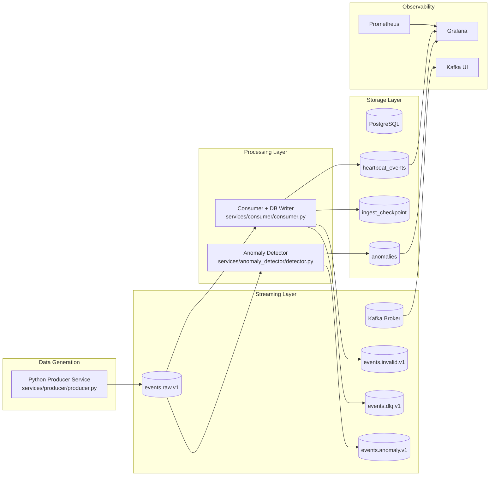
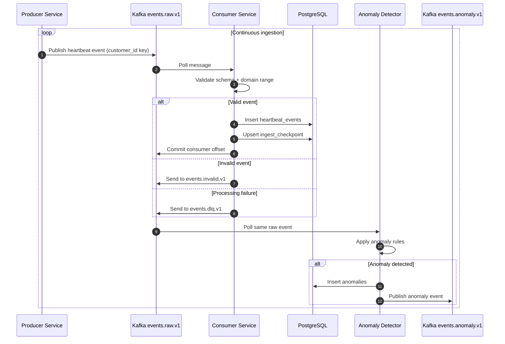

# Architecture Overview: Real-Time Customer Heartbeat Monitoring System

This document explains the full system architecture, end-to-end data flow, and the exact solution implemented in this project.

## 1) Solution Goal

Build a real-time pipeline that:
- Simulates heartbeat sensor data for many customers.
- Streams data continuously through Kafka.
- Validates and persists data in PostgreSQL.
- Detects anomalies (low/high/spike heart rate).
- Exposes operational visibility through Grafana + Prometheus + Kafka UI.

## 2) High-Level Architecture

## 3) Detailed Data Flow

## 4) Components and Responsibilities

### Infrastructure (Docker Compose)
- Zookeeper: coordination service for Kafka.
- Kafka: message broker for streaming events/topics.
- PostgreSQL: persistent relational store for events and anomalies.
- Prometheus: metrics collection.
- Grafana: dashboard and visualization.
- Kafka UI: topic/consumer/broker inspection.

### Application Services
- Producer (`services/producer/producer.py`)
  - Generates continuous synthetic heartbeat events.
  - Supports burst behavior and customer-scale simulation.
  - Publishes to `events.raw.v1` keyed by `customer_id`.

- Consumer (`services/consumer/consumer.py`)
  - Reads from `events.raw.v1`.
  - Validates payload and heart-rate domain limits.
  - Inserts valid records into PostgreSQL.
  - Stores offsets in `ingest_checkpoint`.
  - Sends invalid records to `events.invalid.v1`.
  - Sends unexpected failures to `events.dlq.v1`.

- Anomaly Detector (`services/anomaly_detector/detector.py`)
  - Reads from `events.raw.v1`.
  - Flags low/high/spike anomalies.
  - Stores anomalies in PostgreSQL.
  - Publishes anomaly events to `events.anomaly.v1`.

## 5) Kafka Topic Design

- `events.raw.v1`: main heartbeat event stream.
- `events.invalid.v1`: structurally/domain-invalid records.
- `events.anomaly.v1`: anomaly notifications.
- `events.dlq.v1`: processing failures for reprocessing/debug.

Partitioning and keying:
- Raw topic uses multiple partitions for throughput.
- Event key is `customer_id` for customer-level ordering.

## 6) Database Design

Schema file: `db/schema/01_schema.sql`

- `heartbeat_events`
  - Stores validated heartbeat events.
  - Indexed on `(customer_id, event_time desc)` and `(event_time desc)`.
  - Unique guard on `(customer_id, event_id)` for idempotency.

- `anomalies`
  - Stores detected anomaly records with severity/type.

- `ingest_checkpoint`
  - Stores last processed offset per consumer group/topic/partition.

## 7) Reliability and Data Quality Controls

- Producer idempotence enabled via Kafka client config.
- Consumer commits offsets after successful DB transaction.
- Invalid and failed messages are isolated into separate topics.
- Domain validation rejects heart-rate values outside configured range.

## 8) Environment and Port Mapping

- Kafka (host): `localhost:19092`
- PostgreSQL (host): `localhost:55432`
- Grafana: `http://localhost:3000`
- Prometheus: `http://localhost:9090`
- Kafka UI: `http://localhost:8080`

## 9) How This Matches the Required Deliverables

- Synthetic Data Generator: implemented in producer/shared simulator.
- Kafka Producer/Consumer: implemented and runnable via Python modules.
- PostgreSQL Storage: schema + insert/checkpoint logic implemented.
- Docker Compose Setup: complete local stack defined and validated.
- Testing: unit/integration/load smoke scripts included.
- Documentation: this architecture report + setup guide + diagrams.
- Optional Dashboard: Grafana provisioning and starter dashboard included.

## 10) Recommended Evidence for Final Report

Capture and store screenshots in `docs/screenshots/` for:
- Running containers (`docker compose ps`).
- Producer/consumer/anomaly service terminals.
- Kafka UI topics and consumer groups.
- PostgreSQL query results for `heartbeat_events` and `anomalies`.
- Grafana dashboard with live metrics/charts.
