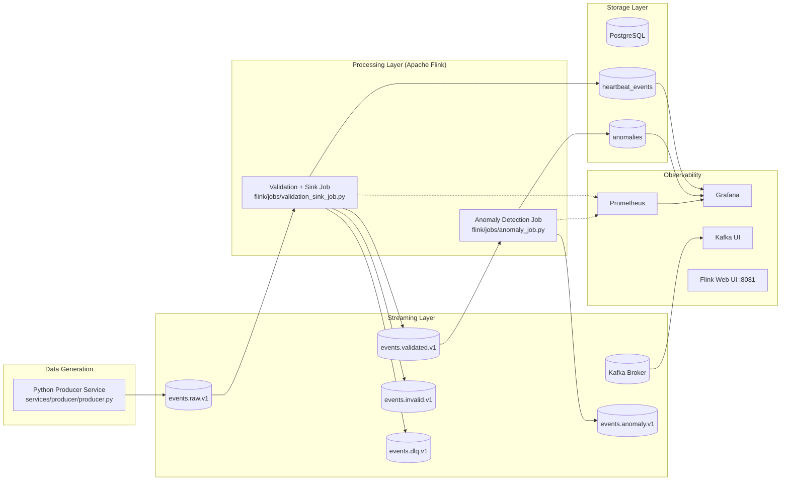
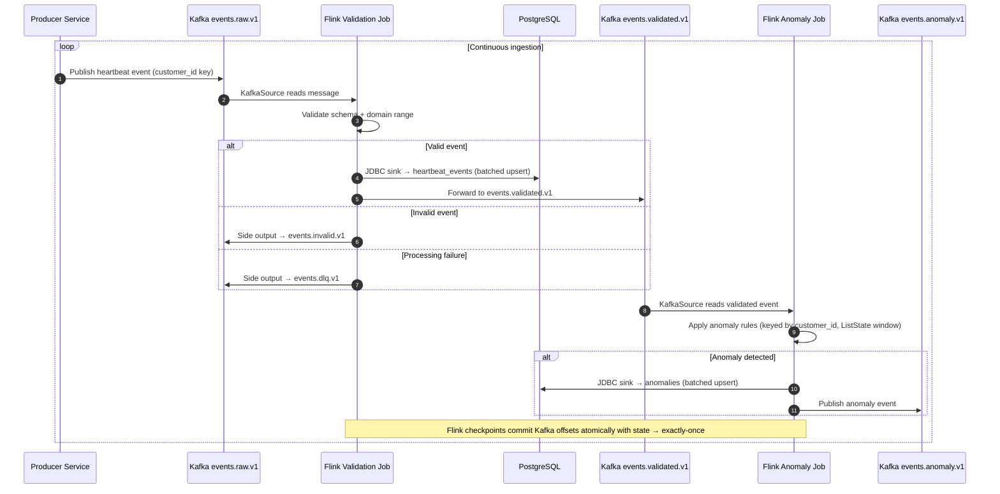

# Architecture Overview: Real-Time Customer Heartbeat Monitoring System

This document explains the full system architecture, end-to-end data flow, and the exact solution implemented in this project.

## 1) Solution Goal

Build a real-time pipeline that:
- Simulates heartbeat sensor data for many customers.
- Streams data continuously through Kafka.
- Validates and persists data in PostgreSQL.
- Detects anomalies (low/high/spike heart rate).
- Exposes operational visibility through Grafana + Prometheus + Kafka UI.

## 2) High-Level Architecture

```mermaid
flowchart LR
  subgraph Data Generation
    G[Python Producer Service\nservices/producer/producer.py]
  end

  subgraph Streaming Layer
    K[(Kafka Broker)]
    T1[(events.raw.v1)]
    TV[(events.validated.v1)]
    T2[(events.invalid.v1)]
    T3[(events.anomaly.v1)]
    T4[(events.dlq.v1)]
  end

  subgraph "Processing Layer (Apache Flink)"
    FV[Validation + Sink Job\nflink/jobs/validation_sink_job.py]
    FA[Anomaly Detection Job\nflink/jobs/anomaly_job.py]
  end

  subgraph Storage Layer
    P[(PostgreSQL)]
    E[(heartbeat_events)]
    N[(anomalies)]
  end

  subgraph Observability
    GR[Grafana]
    PR[Prometheus]
    KUI[Kafka UI]
    FUI[Flink Web UI :8081]
  end

  G --> T1
  T1 --> FV

  FV --> E
  FV --> TV
  FV --> T2
  FV --> T4

  TV --> FA
  FA --> N
  FA --> T3

  E --> GR
  N --> GR
  PR --> GR
  K --> KUI
  FV -.-> PR
  FA -.-> PR
```

## 3) Detailed Data Flow

```mermaid
sequenceDiagram
  autonumber
  participant Producer as Producer Service
  participant RawTopic as Kafka events.raw.v1
  participant FlinkVal as Flink Validation Job
  participant DB as PostgreSQL
  participant ValidTopic as Kafka events.validated.v1
  participant FlinkAnom as Flink Anomaly Job
  participant AnomalyTopic as Kafka events.anomaly.v1

  loop Continuous ingestion
    Producer->>RawTopic: Publish heartbeat event (customer_id key)
    RawTopic->>FlinkVal: KafkaSource reads message
    FlinkVal->>FlinkVal: Validate schema + domain range
    alt Valid event
      FlinkVal->>DB: JDBC sink → heartbeat_events (batched upsert)
      FlinkVal->>ValidTopic: Forward to events.validated.v1
    else Invalid event
      FlinkVal->>RawTopic: Side output → events.invalid.v1
    else Processing failure
      FlinkVal->>RawTopic: Side output → events.dlq.v1
    end

    ValidTopic->>FlinkAnom: KafkaSource reads validated event
    FlinkAnom->>FlinkAnom: Apply anomaly rules (keyed by customer_id, ListState window)
    alt Anomaly detected
      FlinkAnom->>DB: JDBC sink → anomalies (batched upsert)
      FlinkAnom->>AnomalyTopic: Publish anomaly event
    end
    Note over FlinkVal,FlinkAnom: Flink checkpoints commit Kafka offsets atomically with state → exactly-once
  end
```

## 4) Components and Responsibilities

### Infrastructure (Docker Compose)
- Zookeeper: coordination service for Kafka.
- Kafka: message broker for streaming events/topics.
- PostgreSQL: persistent relational store for events and anomalies.
- **Flink JobManager**: coordinates Flink job execution, checkpoints, and recovery.
- **Flink TaskManager**: runs the actual stream operators (source, map, sink). Scales horizontally.
- Prometheus: metrics collection (scrapes Producer + Flink cluster).
- Grafana: dashboard and visualization (PostgreSQL + Prometheus datasources).
- Kafka UI: topic/consumer/broker inspection.

### Application Services
- Producer (`services/producer/producer.py`)
  - Generates continuous synthetic heartbeat events.
  - Supports burst behavior and customer-scale simulation.
  - Publishes to `events.raw.v1` keyed by `customer_id`.

- **Flink Validation + Sink Job** (`flink/jobs/validation_sink_job.py`)
  - Reads from `events.raw.v1` via KafkaSource.
  - Validates payload schema and heart-rate domain limits using Pydantic.
  - Writes valid records to PostgreSQL via JDBC sink (batched upserts).
  - Forwards valid records to `events.validated.v1` for downstream processing.
  - Routes invalid records to `events.invalid.v1` (side output).
  - Routes unexpected failures to `events.dlq.v1` (side output).
  - Replaces the original Python consumer (`services/consumer/consumer.py`).

- **Flink Anomaly Detection Job** (`flink/jobs/anomaly_job.py`)
  - Reads from `events.validated.v1` via KafkaSource.
  - Keys stream by `customer_id`; maintains per-customer rolling window
    (last 6 readings) in Flink managed `ListState` (RocksDB-backed).
  - Applies LOW/HIGH/SPIKE anomaly rules.
  - Writes anomalies to PostgreSQL via JDBC sink.
  - Publishes anomaly events to `events.anomaly.v1`.
  - Replaces the original Python anomaly detector (`services/anomaly_detector/detector.py`).

### Shared Modules (`services/common/`)
- `config.py` — Centralised, validated settings via pydantic-settings (env vars / `.env`).
- `models.py` — Frozen Pydantic models: `HeartbeatEvent`, `AnomalyEvent`, `InvalidEvent`.
- `simulator.py` — Physiologically realistic Gaussian-baseline heart-rate generator.
- `kafka_utils.py` — Production-hardened Kafka producer/consumer factories.
- `db.py` — psycopg `ConnectionPool` with exponential-backoff retry logic.
- `logging_config.py` — Structured JSON logging (python-json-logger) for all services.

### Utilities
- **Generator CLI** (`services/generator/generate.py`)
  - Prints 100 sample heartbeat events to stdout as JSON.
  - Useful for debugging the simulator without starting the full pipeline.

> **Legacy services retained**: The original Python consumer and anomaly detector
> code remains in `services/consumer/` and `services/anomaly_detector/` for
> reference, but they are no longer built or deployed via docker-compose.

## 5) Kafka Topic Design

| Topic | Partitions | Purpose |
|-------|-----------|---------|
| `events.raw.v1` | 24 | Main heartbeat event stream (producer → Flink validation) |
| `events.validated.v1` | 24 | Validated events (Flink validation → Flink anomaly) |
| `events.invalid.v1` | 6 | Schema/domain-invalid records (quarantine) |
| `events.anomaly.v1` | 6 | Anomaly notifications (downstream alerting) |
| `events.dlq.v1` | 6 | Processing failures for reprocessing/debug |

Partitioning and keying:
- Raw and validated topics use 24 partitions for high throughput.
- Event key is `customer_id` for customer-level ordering and Flink key-by affinity.
- Quarantine/anomaly/DLQ topics use 6 partitions (lower volume).

## 6) Database Design

Schema file: `db/schema/01_schema.sql`

- `heartbeat_events`
  - Stores validated heartbeat events.
  - Indexed on `(customer_id, event_time desc)` and `(event_time desc)`.
  - Unique guard on `(customer_id, event_id)` for idempotency.

- `anomalies`
  - Stores detected anomaly records with severity/type.

- `ingest_checkpoint`
  - Stores last processed offset per consumer group/topic/partition.

## 7) Reliability and Data Quality Controls

- **Exactly-once semantics**: Flink checkpointing commits Kafka consumer offsets atomically with operator state, ensuring each event is processed exactly once — even after restarts.
- **Backpressure handling**: Flink's credit-based flow control automatically slows the Kafka source when JDBC or Kafka sinks are saturated. No message loss, no OOM.
- **Durable state**: Per-customer anomaly history is stored in RocksDB-backed ListState, checkpointed to disk. SPIKE detection works immediately after failover.
- **Idempotent writes**: Both JDBC sinks use ON CONFLICT DO NOTHING with unique constraints (`(customer_id, event_id)` for heartbeats, `(event_id, anomaly_type)` for anomalies).
- **Multi-layer validation**: Hard bounds (Pydantic model) → Soft bounds (configurable domain range) → Anomaly detection (statistical).
- **Quarantine isolation**: Invalid and failed messages are routed to separate topics for audit/replay.
- Producer idempotence enabled via Kafka client config (`enable.idempotence=true`).

## 8) Environment and Port Mapping

| Service | Host URL | Purpose |
|---------|----------|---------|
| Kafka | `localhost:19092` | External broker access |
| PostgreSQL | `localhost:55432` | Database access |
| Grafana | `http://localhost:3000` | Dashboards |
| Prometheus | `http://localhost:9090` | Metrics |
| Kafka UI | `http://localhost:8080` | Topic browser |
| Flink Web UI | `http://localhost:8081` | Job status, checkpoints, backpressure |
| Flink Metrics | `localhost:9249` | Prometheus scrape endpoint |

## 9) How This Matches the Required Deliverables

- Synthetic Data Generator: implemented in producer/shared simulator.
- Kafka Producer/Consumer: implemented and runnable via Python modules.
- PostgreSQL Storage: schema + insert/checkpoint logic implemented.
- Docker Compose Setup: complete local stack defined and validated.
- Testing: unit/integration/load smoke scripts included.
- Documentation: this architecture report + setup guide + diagrams.
- Optional Dashboard: Grafana provisioning and starter dashboard included.

## 10) Recommended Evidence for Final Report

Capture and store screenshots in `docs/screenshots/` for:
- Running containers (`docker compose ps`).
- Producer/consumer/anomaly service terminals.
- Kafka UI topics and consumer groups.
- PostgreSQL query results for `heartbeat_events` and `anomalies`.
- Grafana dashboard with live metrics/charts.
