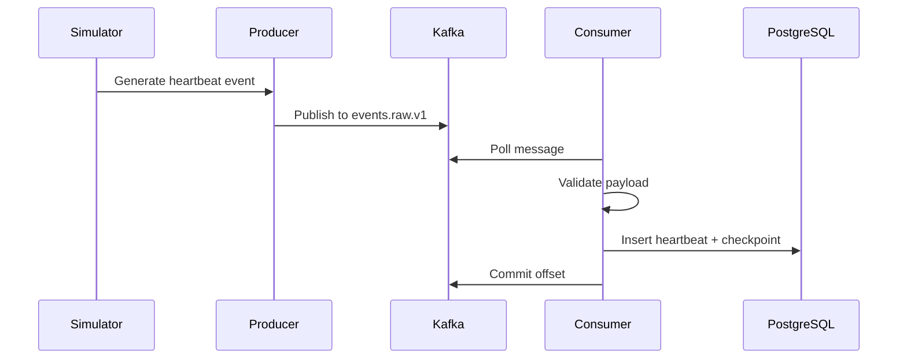

# Ingestion Sequence

```mermaid
sequenceDiagram
  participant Sim as Simulator
  participant Prod as Producer
  participant Kafka as Kafka
  participant Cons as Consumer
  participant DB as PostgreSQL

  Sim->>Prod: Generate heartbeat event
  Prod->>Kafka: Publish to events.raw.v1
  Cons->>Kafka: Poll message
  Cons->>Cons: Validate payload
  Cons->>DB: Insert heartbeat + checkpoint
  Cons->>Kafka: Commit offset
```

Export this sequence diagram to PNG or PDF for submission.
