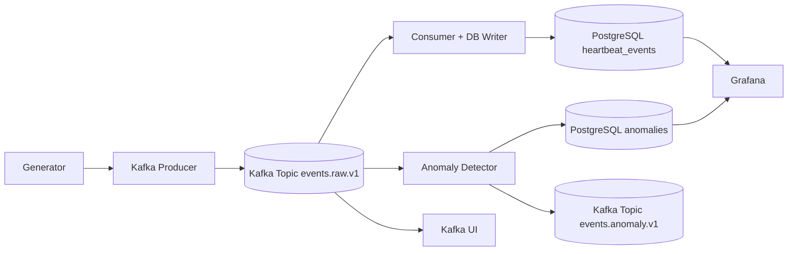

# System Topology

```mermaid
flowchart LR
  G[Generator] --> P[Kafka Producer]
  P --> K[(Kafka Topic events.raw.v1)]
  K --> C[Consumer + DB Writer]
  K --> A[Anomaly Detector]
  C --> D[(PostgreSQL heartbeat_events)]
  A --> AD[(PostgreSQL anomalies)]
  A --> KA[(Kafka Topic events.anomaly.v1)]
  D --> GR[Grafana]
  AD --> GR
  K --> UI[Kafka UI]
```

Export this diagram to PNG or PDF for submission.
